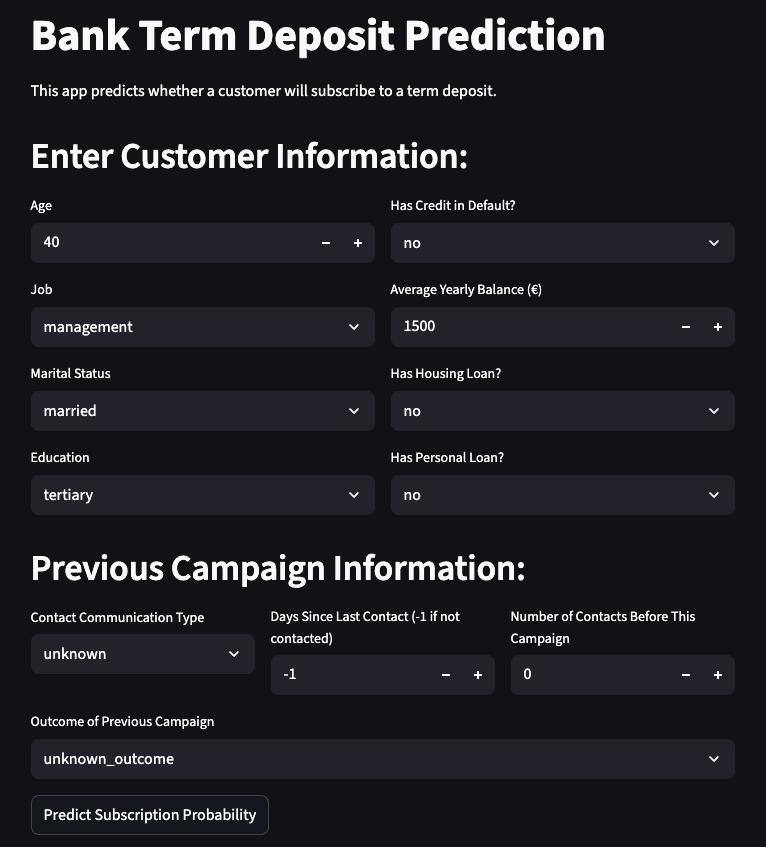

## **Boosting Marketing Efficiency: A Predictive Web App for Bank Campaigns**

**Live App Demo:** [**bank-deposit-prediction.streamlit.app**](https://thisishan-bank-deposit-prediction.streamlit.app/)

### **Project Summary**
Banks spend significant marketing budget on broad, untargeted campaigns, leading to inefficient budget spend and high customer acquisition costs. This project builds and deploys a machine learning model that transforms marketing from a wide net into a precision spear, predicting which customers are most likely to subscribe to a term deposit.

---

### **Key Findings & Recommended Strategy**
| Strategy | Clients to Call | Subscribers Captured | Marketing Cost | Revenue | ROI |
|----------|----------------|---------------------|----------------|---------|-----|
| **Balanced (Recommended)** | **131** | **40** | **€655** | **€2,000** | **205.3%** |
| High-Precision | 27 | 11 | €135 | €550 | 307.4% |
| High-Recall | 508 | 82 | €2,540 | €4,100 | 61.4% |

The final model, a tuned Random Forest classifier, identified key predictors like client balance, age, and past campaign success. Based on a precision-recall analysis, the recommended **"Balanced Strategy"** delivers a strong return on investment while still capturing a significant portion of potential subscribers.

**Why Balanced Strategy?**
- **234% higher ROI** than High-Recall by reducing marketing cost by 74%.
- **264% more revenue** than High-Precision by capturing 3.5x more subscribers.
- With Balanced Strategy, for every **€1.00 spent** on targeted campaigns, the bank earns **€2.05 in profit.**
- Provides the most scalable approach for both profitability and market penetration.

For a detailed walkthrough of the analysis and business scenarios, see the [**full PDF Report.**](./Boosting%20Marketing%20Efficiency.pdf)

---

### **Project Navigation**
- [**01_data_cleaning_and_EDA:**](./notebooks/01_data_cleaning_and_EDA.ipynb) This notebook covers the full data cleaning process and exploratory analysis. 
- [**02_feature_engineering_and_modeling:**](./notebooks/02_feature_engineering_and_modeling.ipynb) This notebook covers techniques applied for feature engineering and model training.
- [**03_business_impact_and_conclusion:**](./notebooks/03_business_impact_and_conclusion.ipynb) This notebook covers business analytics and the overall conclusion.

---

### **Technology Stack & Methods**
- **Technology:** Python, Pandas, NumPy, Scikit-learn, Seaborn, Matplotlib, Joblib
- **Methods:** Data Cleaning & EDA, Feature Engineering (One-Hot Encoding), Class Imbalance Handling (SMOTE), Predictive Modeling (Logistic Regression, Random Forest, XGBoost), Hyperparameter Tuning (GridSearchCV), Model Evaluation.

---

### **Setup & How to Run**
1. Clone the repository to your local machine.
2. Create and activate a new virtual environment
3. Install the required dependencies in 'pip install -r requirements.txt'
4. To run the web locally: 'streamlit run app.py'

#### Data Source
*S. Moro, P. Cortez and P. Rita. A Data-Driven Approach to Predict the Success of Bank Telemarketing. Decision Support Systems, Elsevier, 62:22-31, June 2014*